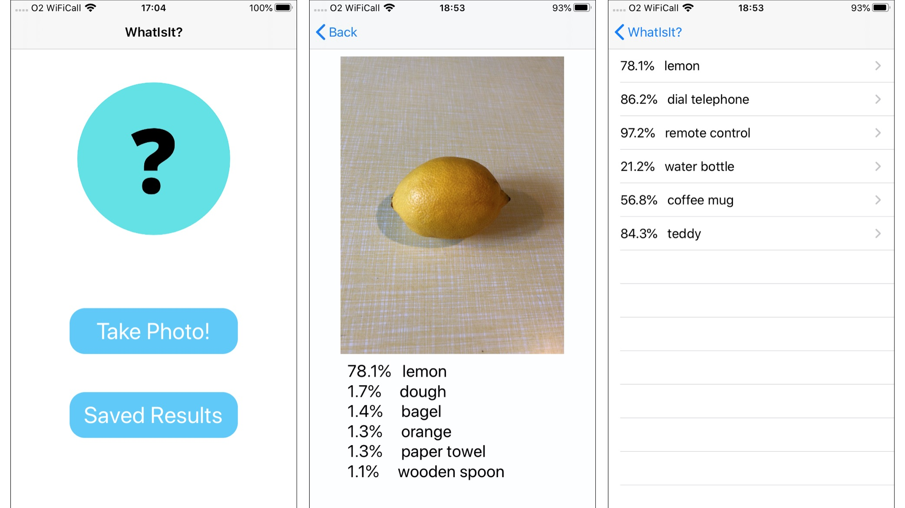

#  WhatIsIt 
### An iOS app using CoreML to identify objects in images

Requires:
Swift 5 + iOS 13

## Overview
A simple swift iOS app that uses the [MobileNetV2](https://arxiv.org/abs/1801.04381) model for object detection in images. The user can take photos and the on-device model predicts the dominant object in the image. No internet connection required. Currently the top 5 predictions are displayed to the user and the image and predictions can be saved to CoreData for later retreival.

If the model produces a prediction with high confidence the app will vocalise the result :)

## To Do
- Add a settings view to control user preferences
- Add the ability to choose different models for predicting objects
